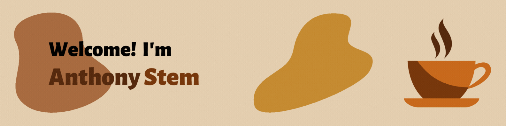

   	

---

<section id="about-me" align="left">
	<h3>Welcome to My Profile!</h3>
	
I am currently studying <strong>Computer Science</strong>, as well as minoring in <strong>Mathematics</strong> and <strong>Statistics</strong>, at the University of Vermont! :evergreen_tree: :mountain:

  	
My primary focus and passion as a developer is full-stack web development! However, I am also deeply interested and passionate about the IoT and automation, particularly home automation.

</section>
<section id="technology-stack" align="center">
	<h2 align="center">:toolbox: Technology Stack :toolbox:</h2>
	
	
	
	
	
	
	
	
	
</section>
<section id="contact" align="center">
	<h2>:envelope: Contact Me! :speech_balloon:</h2>
	
If you want to reach out to me, you can do so through the following:

	
	
</section>

---
